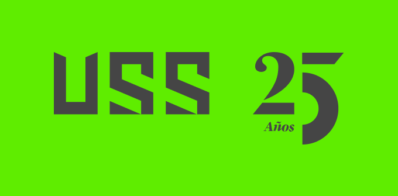

# Universidad Señor Sipán

## TRANSPARENCIA: Índice

### ESTATUTO, PLAN ESTRATÉGICO Y REGLAMENTOS DE LA UNIVERSIDAD

- [Misión y Visión Institucional](#misión-y-visión)
- [Estatuto Universitario 🔗](https://www.uss.edu.pe/uss/TransparenciaDoc/DocumentosGenerales/Estatuto.pdf)
- [Resumen de Plan Estratégico 🔗](https://www.uss.edu.pe/uss/TransparenciaDoc/DocumentosGenerales/Plan%20Estrat%C3%A9gico%20Institucional%202023-2027%20V03.pdf)
- [Reglamentos](#reglamentos)

### RELACIÓN DE PAGOS EXIGIDOS A LOS ALUMNOS POR TODA ÍNDOLE

- [Reglamento de Cobranzas](#relación-de-pagos-exigidos-a-los-alumnos-por-toda-índole)

### LAS REMUNERACIONES, BONIFICACIONES Y DEMÁS ESTÍMULOS A LAS AUTORIDADES Y DOCENTES

- [Escala de Remuneración de autoridades y docentes](#las-remuneraciones-bonificaciones-y-demás-estímulos-a-las-autoridades-y-docentes)
- [Estímulos al Docente](#las-remuneraciones-bonificaciones-y-demás-estímulos-a-las-autoridades-y-docentes)

### OTROS DOCUMENTOS INSTITUCIONALES

- [Calendario de Admisión](#calendario-de-admisión)
- [Temario Admisión](#temario-admisión)
- [Ambientes o Espacios destinados a Brindar los Servicios Sociales, Deportivos o Culturales 🔗](https://www.uss.edu.pe/uss/TransparenciaDoc/OtrosDocumentos/Ambientes%20Universitarios%202023-II.pdf)
- [Mallas Curriculares](#mallas-curriculares)
- [Vacantes y Fechas de Concurso de Selección Docente](#vacantes-y-fechas-de-concurso-de-selección-docente)
- [Otros - En proceso](#otros-en-proceso)

---

## Misión y visión

### VISIÓN USS:

Ser líder regional con proyección internacional, con base en la excelencia académica, investigación, infraestructura y tecnología que responda a las necesidades de la sociedad.

### MISIÓN USS:

Formar profesionales con perfil emprendedor, competitivos y comprometidos con la responsabilidad social.

- Fuente: Plan Estratégico Institucional 2023-2027 V03
- Resolución de Directorio N° 0059-2024/PD-USS de fecha 09 de abril del 2024

## Reglamentos

- [Reglamento del Estudiante 🔗](https://www.uss.edu.pe/uss/TransparenciaDoc/RegEstudiantes/REGLAMENTO%20DEL%20ESTUDIANTE.pdf)
- [Reglamento de Admisión 🔗](https://www.uss.edu.pe/uss/TransparenciaDoc/RegAdm/Reglamento_de_admision.pdf)
- [Reglamento de Matrícula 🔗](https://www.uss.edu.pe/uss/TransparenciaDoc/RegEstudiantes/REGLAMENTO%20DE%20MATRICULA%20GENERAL%20USS.pdf)
- [Reglamento de Cobranzas 🔗](https://www.uss.edu.pe/uss/TransparenciaDoc/RegEstudiantes/cobranzas.pdf)
- [Reglamento de Apoyo Estudiantil 🔗](https://www.uss.edu.pe/uss/TransparenciaDoc/RegEstudiantes/apoyoestudiantil.pdf)
- [Reglamento de Convalidaciones 🔗](https://www.uss.edu.pe/uss/TransparenciaDoc/RegEstudiantes/REGLAMENTO%20DE%20CONVALIDACIONES.pdf)
- [Reglamento de Rectificación de Notas y Declaratoria de Inhabilitación 🔗](https://www.uss.edu.pe/uss/TransparenciaDoc/RegEstudiantes/REGLAMENTO%20RECTIFICACION%20DE%20NOTAS.pdf)
- [Reglamento de Evaluación del Aprendizaje de Pregrado y Posgrado 🔗](https://www.uss.edu.pe/uss/TransparenciaDoc/RegEstudiantes/REGLAMENTO%20DE%20EVALUACION%20DEL%20APRENDIZAJE.pdf)
- [Reglamento de Certificaciones Progresivas por Competencias para estudiantes Pregrado USS 🔗](https://www.uss.edu.pe/uss/TransparenciaDoc/RegEstudiantes/REGLAMENTO_CERTIFICACIONES.pdf)
- [Reglamento de Investigación de la Universidad Señor de Sipán SAC 🔗](https://www.uss.edu.pe/uss/TransparenciaDoc/RegInvestigacion/Reglamento%20de%20Investigación.pdf)
- [Reglamento de Propiedad Intelectual de la Universidad Señor de Sipán SAC 🔗](https://www.uss.edu.pe/uss/TransparenciaDoc/RegInvestigacion/Reglamento%20de%20Propiedad%20Intelectual.pdf)
- [Reglamento del Comité Institucional de Ética en Investigación de la Universidad Señor de Sipán SAC 🔗](https://www.uss.edu.pe/uss/TransparenciaDoc/RegInvestigacion/Reglamento%20CIEI.pdf)
- [Código de Ética en Investigación 🔗](https://www.uss.edu.pe/uss/TransparenciaDoc/RegInvestigacion/Código%20de%20Ética.pdf)
- [Reglamento de Movilidad Estudiantil, Docente y Administrativa 🔗](https://www.uss.edu.pe/uss/TransparenciaDoc/RegEstudiantes/REGLAMENTO%20DE%20MOVILIDAD%20ESTUDIANTIL%20Y%20DOCENTE%20Y%20ADMINSTRATIVA.pdf)
- [Reglamento Doble Grado Internacional 🔗](https://www.uss.edu.pe/uss/TransparenciaDoc/RegEstudiantes/REGLAMENTO%20DOBLE%20GRADO%20INTERNACIONAL.pdf)
- [Reglamento Para la Suscripción de Convenios de Cooperación Nacional e Internacional 🔗](https://www.uss.edu.pe/uss/TransparenciaDoc/RegEstudiantes/REGLAMENTO%20NACIONALES%20E%20INTERNACIONALES.pdf)
- [Reglamento de Deportes 🔗](https://www.uss.edu.pe/uss/TransparenciaDoc/RegEstudiantes/REGLAMENTO%20DE%20DEPORTES.pdf)
- [Reglamento de Practicas Pre Profesionales 🔗](https://www.uss.edu.pe/uss/TransparenciaDoc/RegEstudiantes/REGLAMENTO%20PRACTICAS%20PRE%20PROFESIONALES.pdf)
- [Reglamento de Grados y Títulos 🔗](https://www.uss.edu.pe/uss/TransparenciaDoc/RegEstudiantes/REGLAMENTO%20GRADOS%20Y%20TITULOS.pdf)
- [Reglamento de Defensoría Universitaria 🔗](https://www.uss.edu.pe/uss/TransparenciaDoc/DocumentosGenerales/reglamento_defensoria_universitaria.pdf)
- [Reglamento del Centro de Información Dr. Roger Pingo Jara 🔗](https://www.uss.edu.pe/uss/TransparenciaDoc/RegEstudiantes/REGLAMENTO%20DEL%20CENTRO%20DE%20INFORMACION.pdf)
- [Reglamento de Gestión Curricular 🔗](https://www.uss.edu.pe/uss/TransparenciaDoc/ReglamentoDoc/REGLAMENTO%20DE%20GESTION%20CURRICULAR.pdf)
- [Reglamento docente 🔗](https://www.uss.edu.pe/uss/TransparenciaDoc/ReglamentoDoc/REGLAMENTO%20DOCENTE.pdf)
- [Reglamento de Evaluación de Desempeño 🔗](https://www.uss.edu.pe/uss/TransparenciaDoc/ReglamentoDoc/REGLAMENTO%20DE%20EVALUACIÓN%20DE%20DESEMPENO.pdf)
- [Reglamento de Prevención y Sanción del Hostigamiento Sexual 🔗](https://www.uss.edu.pe/uss/TransparenciaDoc/DocumentosGenerales/Reglamento_Prevención_Sanción_del_Hostigamiento_Sexual.pdf)
- [Reglamento de Organización y Funciones (ROF) 🔗](https://www.uss.edu.pe/uss/TransparenciaDoc/DocumentosGenerales/ROF.pdf)
- [Reglamento de Transparencia 🔗](https://www.uss.edu.pe/uss/TransparenciaDoc/ReglamentoDoc/PD2-RE01%20Reglamento%20de%20Transparencia.pdf)

## DIRECTIVAS, INSTRUCTIVOS, LINEAMIENTOS DE INVESTIGACIÓN

- [Directiva del Repositorio Institucional 🔗](https://www.uss.edu.pe/uss/TransparenciaDoc/DirInvestigacion/Directiva%20del%20Repositorio%20Institucional%20V3.pdf)
- [Directiva sobre índice de similitud de los productos académicos 🔗](https://www.uss.edu.pe/uss/TransparenciaDoc/DirInvestigacion/DI-I-DISPA%20DIRECT%20IND%20SIM%20PROD%20ACRED.pdf)
- [Instructivo de mecanismos de control y seguimiento de la ejecución de los proyectos de investigación 🔗](https://www.uss.edu.pe/uss/TransparenciaDoc/DirInvestigacion/Instructivo%20de%20mecanismos%20y%20control%20y%20seguimiento%20de%20la%20ejecución%20de%20pi.pdf)
- [Lineamientos para incentivos económicos por Publicaciones 🔗](https://www.uss.edu.pe/uss/TransparenciaDoc/DirInvestigacion/PP2-DG04%20V08.pdf)
- [Lineamientos para la Entrega de Incentivos a Docentes Calificados como Investigadores Renacyt 🔗](https://www.uss.edu.pe/uss/TransparenciaDoc/DirInvestigacion/PP2-DG02%20V3.pdf)
- [Lineamientos para apoyo de derecho de pago por publicación y traducción de manuscritos científicos 🔗](https://www.uss.edu.pe/uss/TransparenciaDoc/DirInvestigacion/PP2-DG03%20V3.pdf)
- [Líneas de Investigación Institucional 🔗](https://www.uss.edu.pe/uss/TransparenciaDoc/DirInvestigacion/DI-I-LI%20V03.pdf)
- [Directiva para el Desarrollo de los Cursos de Investigación y Trabajos conducentes a Títulos Profesionales 🔗](https://www.uss.edu.pe/uss/TransparenciaDoc/DirInvestigacion/PP2-DI03%20DESARR%20CUR%20INVES%20TESIS%20PRE%20V4.pdf)
- [Directiva para el Desarrollo de los Cursos de Investigación y Trabajos Conducentes a Grado Académico Escuela de Posgrado 🔗](https://www.uss.edu.pe/uss/TransparenciaDoc/DirInvestigacion/PP2-DI04%20Directiva%20Posgrado.pdf)
